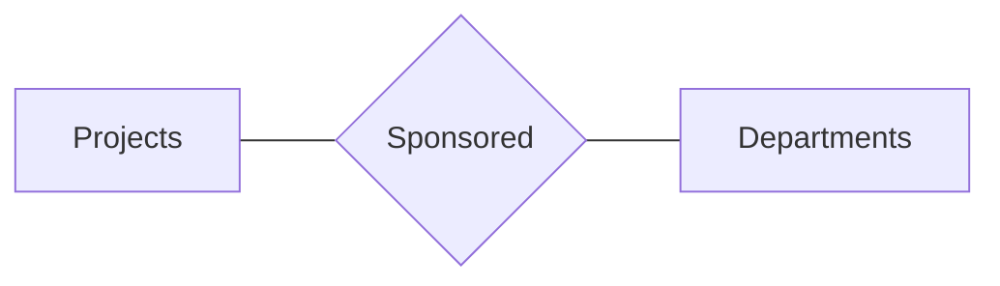
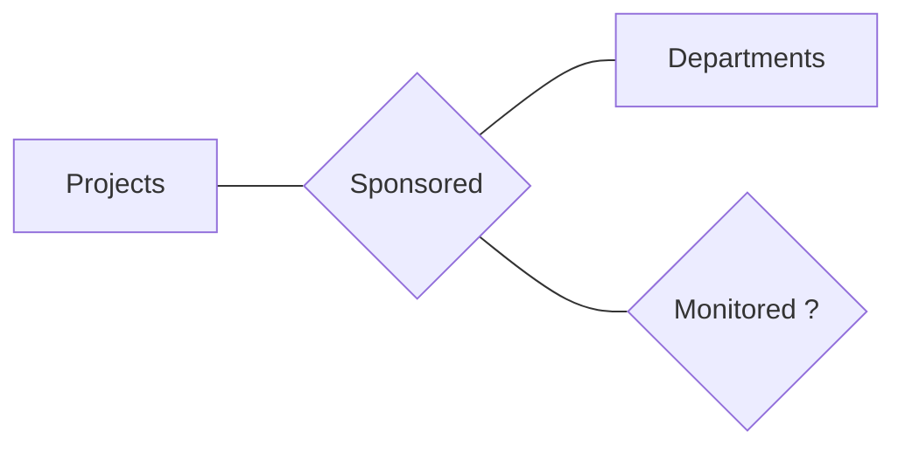
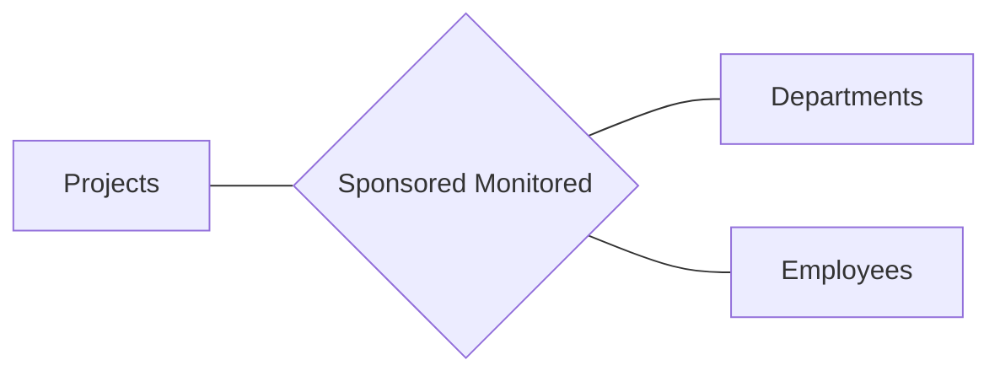
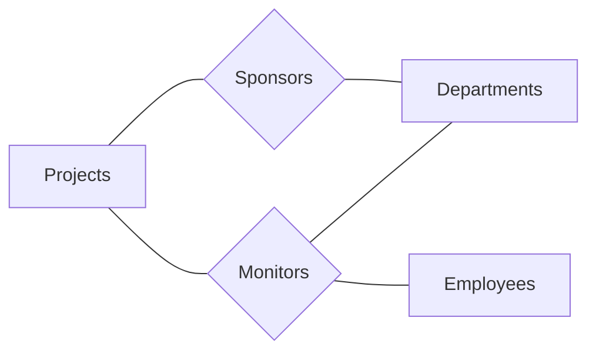
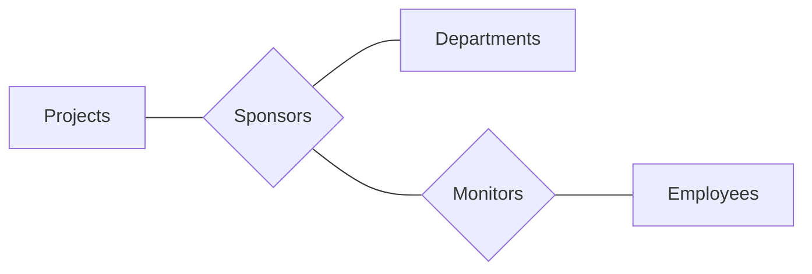

#ER-model 

> [!tip]
> 1. **Requirements Analysis**
> *2. **Conceptual DB Design**: high-level description of data and constraints, typically using ER modeling*
> 3. **Logical DB Design**
> 4. **Schema Refinement**
> 5. **Physical DB Design**
> 6. **Application/Security Design**


## I. Data Modeling
---
> [!note]
> A relational database is a collection of relations.

We need a semantic (high-level) model to translate this relationship to an application.

Thus we need to follow a *database design process* (Slide 4/53).

### 6 steps of database design
1. **Requirements Analysis**: data requirements, critical operations on the data
2. **Conceptual DB Design**: high-level description of data and constraints, typically using ER modeling
3. **Logical DB Design**: conversion into a schema
	- pick a type of DBMS, most popularly relational DBMS
4. **Schema Refinement**: normalization (eliminating redundancy)
5. **Physical DB Design**: load balancing, indexing and clustering data
6. **Application/Security Design**

## II. Entity-Relationship Model (ER)
---
- A visual model
- An **entity** maps to tuple of attributes
- An **attribute** can be:
	- *single-valued* or *multi-valued*
	- *atomic* or *composite*
	- *stored* or *derived*
	- part of a **key** (a set of attributes)
		- In the case many keys exist, a **primary key** is decided.
- A **relationship** is an association among two or more entities
	- **relationship set**: collection of similar relationships

### Constraints on  Relationship Sets
#### 1. Key
- one to one
- one to many
	- ***relationship attributes*** **can be moved to the many side**.
	```mermaid
	graph TB
		employee --- m{manages} --- since
		departments --> m
    ```
	```mermaid
	graph TD
		employee --- m{manages}
		since --- departments --> m
    ```
- many to many

#### 2. Participation
- partial
- total

### Weak Entity Sets
- entity sets that *do not have enough attributes to form a key* are called **weak entity sets**.
- complete dependent on the primary key of another **owner** entity for unique identification.
- owner set and weak entity set's *relationship set* must be:
	- *one-to-many* (single owner, many weak entities)
	- weak entities have *total participation*
- **partial key**
	- may be used to distinguish between weak entities related to the same owner
	```
	key of weak entities = key of owner set + partial key
	Example:
		StateName is unique
		CityName can be duplicate
		key for CityName = StateName + CityName
	```
 
- a weak entity can be owner of another weak entity


## Limitations
---
The basic ER model cannot express subtle differences and in turn causes a loss of information.

#### The Problem
For example, we have have the following *entity sets* and *relationship*:
- $E^1$: **Projects**
- $E^2$: **Departments**
- $R$: each project $e^1_i\in E^1$ is sponsored by one or more department $\{e^2_j\dots e^2_k\}\in E^2$
$$
\begin{align}
&E^1\quad \boldsymbol{R}\quad E^2\cr
&\forall e^1 \in E^1, e^1 \textbf{ is sponsored by } \{\textbf{C}^n_k : E^2\}\cr
\end{align}
$$




Now, *a sponsoring department **might** assign an employee to monitor the sponsorship*, intuitively implying a new relationship set Monitors that associates an entity in Sponsors with an entity in Employees.

#### Approach #1
However, we have previously defined that *relationships associate two or more entities*. With the basic ER model, we can only add another entity set Employees.



This is incorrect. It does not capture the correct information about the relationship. This reads as *each sponsorship **must** have one monitoring employee*, which is not what we are looking for.

#### Approach #2
Since that doesn't work, another approach is to fix Projects and Departments with another ternary relationship.



Unfortunately, this produces a redundancy, i.e. a duplicate information for projects and departments just to identify those employees assigned for this monitoring task.

#### Aggregation extends ER Model
Then, how do we correctly differentiate between **might** and **must**?

We see that we have run into the limits of the basic ER model. We have no choice but to extend it in order to reflect the correct information.

We use **aggregation** to indicate *the participation (total or partial)* of some relationship set in another relationship set.




## Pitfalls
---
### 1. Entity vs. Attribute (Slides 46-47)
Should "dependent" be an attribute of Employees or an entity (connected to Employees by a relationship)?

- If we have several dependents per employee, "dependent" must be an entity (*since attributes cannot be set-valued*).
- If "dependent" has its own attributes, it must be modeled as an entity (*since attribute values are atomic*).

### 2.  Subclass Relationship (Slides 48-50)

### 2. Entity vs. Relationship

### 3. Binary vs. Ternary
