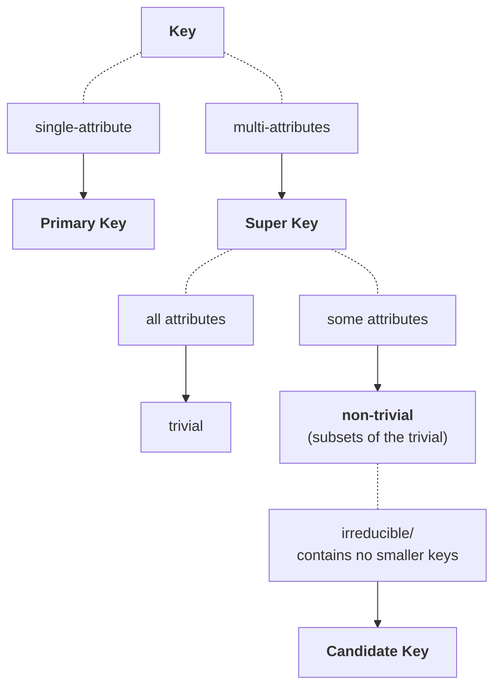

#design-theory #schema-refinement #functional-dependencies #normal-form #1NF #2NF #3NF #BCNF #normalization #loss-join #dependency-preserving

> [!tip] DB Design Program
> 1. Requirement Analysis
> 2. Conceptual DB Design
> 3. Logical DB Design
> 4. **Schema Refinement:** *normalization*
> 	- eliminate redundancy
> 5. Physical DB Design: consider workloads, indexes and clustering of data
> 6. Application/Security Design

# I. Schema Refinement

There are few **problems caused by redundancies**:
- ***redundant storage***
	- unnecessary duplication of data
- inconsistency on UPDATE
	- case:
		- when one copy of repeated data is updated
	- expectation:
		- all data must be updated
- inconsistency on INSERT
	- case: 
		- it may not be possible to store some information,
	- expectation:
		- unless some other unrelated information is also added
- inconsistency on DELETE
	- case:
		- it may not be possible to remove some data
	- expectation:
		- without losing some other unrelated data

## Solution
- Design by decomposition
	- We start with "mega" relations, break them down into smaller (and better) relations with the same information.
	- Automatic decomposition
		- Mega relations + properties of the data (*functional dependency*)
		- System will then decompose automatically based on properties
		- Final sets of relations satisfy *normal form*
			- *i.e.* there shall be no inconsistencies, and no loss of information

# II. Functional Dependencies

## Decomposition

- Lossless-Join
- Dependency-Preserving

# III. Normalization & Normal Forms

- https://www.wikiwand.com/en/Database_normalization

| Normal Form | Description                                                                   |
| ----------- | ----------------------------------------------------------------------------- |
| 1NF         | - Eliminate *repeating groups* in individual tables.                          |
|             | - Create *separate table for each set* of related data.                       |
|             | - Identify each set of related data *with a primary key*.                     |
| 2NF         | - Create separate *tables for sets of values that apply to multiple records*. |
|             | - Relate these tables *with a foreign key*.                                   |
| 3NF         | - Eliminate *fields that do not depend* on the key.                           |
| BCNF        | - Is a *slightly stronger* version of 3NF                                     |
|             |                                                                               |

| Constraint                                                                                                                                                                                                                                                                                             | 1NF | 2NF | 3NF | BCNF | 4NF |
| ------------------------------------------------------------------------------------------------------------------------------------------------------------------------------------------------------------------------------------------------------------------------------------------------------ | --- | --- | --- | ---- | --- |
| **rows: unique** (no duplicate records)                                                                                                                                                                                                                                                                | OK  | OK  | OK  | OK   | OK  |
| **columns: distinct scalars** (columns can not contain relations or composite values)                                                                                                                                                                                                                  | OK  | OK  | OK  | OK   | OK  |
| non-prime attributes must <u>depend fully</u> on a Candidate Key, not part of it (full functional dependency). (attributes depend on a complete primary key)                                           |     | OK  | OK  | OK   | OK  |
| Non-trivial functional dependencies either - begin with a super-key, or - end with a prime attribute. (attributes depend only on the primary key) |     |     | OK  | OK   | OK  |
| Non-trivial functional dependencies either - begin with a super-key, or - end with an elementary prime attribute. (stricter form of 3NF)          |     |     |     | OK   | OK  |
| Non-trivial multi-valued functional dependencies  begin with a super-key.                                                                                            |     |     |     |      | OK  |

### Database Normalization

Database normalization is the process of structuring a relational database in accordance with a series of normal forms in order to:

1. **reduce data redundancy**, and
2. **improve data integrity**.

### Types of Keys

### 1NF

1. atomic data points
	- for each attribute $A_i$ in the table should contain *atomic* data, ie no records should contains *data separated by comma* (multi-valued) in any of its columns.
2. *unique* **attributes** and *distinct* **records**

### 2NF

1. is 1NF.
2. any non-prime attribute $A_i$ must depend fully on the *Candidate Key* (ie no partial dependency).
	- case 1: has a ***single***-attribute UID (super-key).
		- every non-prime attribute $A_i$ must depend on the UID.
	- case 2: has a ***multi***-attribute UID (super-key).
		- every non-prime attribute $A_i$ *that are not part of the Candidate Key* must depend on all attributes in the UID, in other words the entire UID itself (no partial dependency).

### 3NF

1. is 2NF.
2. No non-prime attributes are *transitively* dependent on the **Primary Key**. 

#### Transitive Dependency

A transitive dependency is an **indirect/implicit functional dependency** where 
$$
\begin{align}
X\rightarrow Z\quad&\text{(X determines Z)}\cr
\text{ where }\cr
&X\rightarrow Y\cr
&Y\rightarrow Z
\end{align}
$$

In other words, a 3NF requires each functional dependency to be a direct and 1-hop order.

### BCNF (Boyce-Codd Normal Form)

> [!info] Definition
> A dependency $X\rightarrow B$ in some relation $\mathbf{R}$ is either **trivial** or **non-trivial**.
> 
> $\mathbf{R}$ is in BCNF if,
> - whenever some dependency $X \rightarrow B$ is **non-trivial**,
> - then X is a _super-key_.

> [!note] Definition (Alternative)
> A relation $\mathbf{R}$ is in BCNF, every dependency $X\rightarrow B$ in $\mathbf{R}$ is either:
> - $X\rightarrow B$ is trivial ($B\subseteq X$), or
> - $X$ is a super-key of $\mathbf{R}$.
> 

| Key       | multi-attribute |
| --------- | --------------- |
| super     | YES             |
| Candidate | YES             |
| Primary   | NO              |

#### Triviality vs Non-Triviality

A super-key is trivial when it covers all attributes (ie the set of all attributes).

It follows that any non-trivial super-keys are keys that cover a subset of the trivial super-key.

#### Candidate Key

A Candidate Key is a **minimal super-key**, ie a super-key that does not contain a smaller key. A super-key is any set of attributes that uniquely identifies each tuple of relation, ie a UID.

#### Primary Key

A Primary is a choice of Candidate Keys. In other words, it can be selected from any subset of the trivial super-key.

### 4NF

- Every non-trivial *multi-attribute* dependency begins with a super-key.