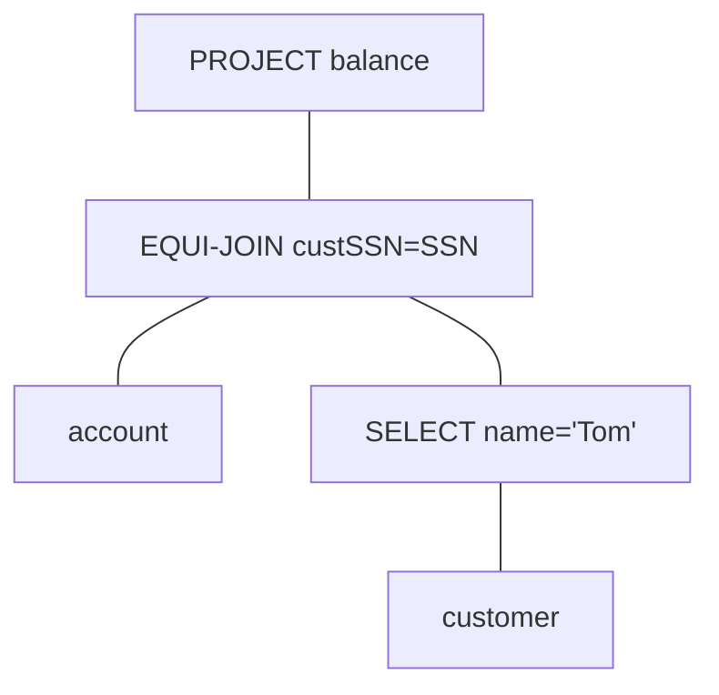

#relation-algebra #join #natural-join #dangling-tuples

## I. Definition
---
Similar to the ER model, Relational Algebra has the basic model and extended model.

More formally,

> [!abstract] Definition
> relational algebra is a branch of math that deals with *algebraic operations (consisting of operands and operators) that represent relations*.
>  - as a query language for relations
>  - theoretical foundation for SQL
>
> The returned relations must have:
> - closure
> - composibility

## II. Operations
---
### BASIC Relational Algebra (Set Semantics)
- [[#Set Operations]]
- [[#Selection]]
- [[#Projection]]
- [[#Cartesian Products]]
- [[#Joins]]
- [[#Renaming]]

#### Set Operations
- Union $\boldsymbol{\cup}$
- intersection $\boldsymbol{\cap}$
- difference $\boldsymbol{-}$

>
>*Relation must have* **the same schema**. For example, we have relations $S$ and $R$. Applying any set operations on these two relations must enforce the requirement that both $S$ and $R$ maintain the same schema.
>

#### Selection
> [!info] Selection
> $$\underbrace{\sigma}_{Condition}(\text{R})$$
> Return tuples in R *that satisfies some condition C*.

#### Projection
> [!info] Project
> $$\prod_{A_1\dots A_k}(\text{R})$$
> Picks columns of attributes $[A_1, \dots A_k]$ of R, *and eliminates duplicate rows, if any*.

##### Extended Projection
> [!info] Extended Projection
> $$\prod_{[A_1\text{, }B:=(A_2 + A_3)]}(\text{R})$$
> The attribute list may contain arbitrary expression involving attributes:
> 1. Arithmetic operations on attributes, e.g. $A_1 + A_2 \rightarrow B$
> 2. Duplicate occurences of the same attributes.
>    $$\prod_{\text{$A_1$, $A_1$, $(A_2 + A_3)$,...}}$$

#### Cartesian Products
> [!info] Cartesian Product $\times$
> $$\text{R}\times\text{S}$$
> Pairs each tuple $r$ in **R** with each tuple $s$ in **S**.
> - Schema of result is the attributes of R and then S, *in order*.
> - If attributes *A* exists both in R and S then use `R.A` and `S.A`.

`Emp(name, dept)`

| Name | Dept    |
| ---- | ------- |
| Jack | physics |
| Tom  | EECS    | 

`Contact(name, addr)`

| Name | Addr    |
| ---- | ------- |
| Jack | Pullman |
| Tom  | Moscow  |
| Mary | Colfax  |

`Emp` $\times$ `Contact`

| Emp.Name | Dept    | Contact.Name | Addr    |
| -------- | ------- | ------------ | ------- |
| Jack     | physics | Jack         | Pullman |
| Jack     | physics | Tom          | Mostcow |
| Jack     | physics | Mary         | Colfax  |
| Tom      | EECS    | Jack         | Pullman |
| Tom      | EECS    | Tom          | Moscow  |
| Tom      | EECS    | Mary         | Colfax  |

#### Joins
> [!info] Join $\bowtie$
> Strictly speaking, #join is an extension of the Cartesian product. It is *Cartesian product and then choosing of only the records filtered with one or more conditions*.
> 
> $$\text{R}\underbrace{\bowtie}_{Condition}\text{S} = \underbrace{\sigma}_C(\text{R}\times\text{S})$$
> Take the product $R\times S$, and then apply $\sigma_C$ (conditional projection) to the result.

##### Theta-Join (non-equal)
- *Can have one or more conditions*.

$$R\underbrace{\bowtie}_{R.A>S.C}S$$
$$R\underbrace{\bowtie}_{R.A>S.C\quad\textbf{AND}\quad R.B\neq S.D}S$$

##### Equi-Join
- Equi-Join: Conditions only use the equality operator
$$R\underbrace{\bowtie}_{R.B=S.D}S$$

##### Natural-Join
- **Connects two relations** by:
	- *equating attributes of the same name* (equi-join), and
	- *projecting out one copy of each* of equated attributes.
- We have relations **R** and **S**,
	- Let *L* be the union of their attributes
	- Let $A_1\dots A_k$ be their common attributes
 
$$R\bowtie S = \underbrace{\Pi}_L(R\underbrace{\bowtie}_{(R.A_1=S.A_1)\textbf{... }(R.A_k=S.A_k)}S)$$

###### 1.a. `Emp(name, dept)`

| Dept    | Name |
| ------- | ---- |
| Physics | Jack |
| EECS    | Tom  |

###### 1.b. `Contact(name, addr)`

| Name | Addr    |
| ---- | ------- |
| Jack | Pullman |
| Tom  | Moscow  |
| Mary | Colfax  |

###### 2.1. Operation

- Cartesian Product, then

| Dept    | Name     | Name     | Name Addr |     |
| ------- | -------- | -------- | --------- | --- |
| Physics | **Jack** | **Jack** | Pullman   |     |
| Physics | Jack     | Tom      | Moscow    |     |
| Physics | Jack     | Mary     | Colfax    |     |
| EECS    | Tom      | Jack     | Pullman   |     |
| EECS    | **Tom*   | **Tom**  | Moscow    |     |
| EECS    | Tom      | Mary     | Colfax    |     |

- *SELECT* *WHERE R.Name = S.Name*

###### 3. Result  `(Emp) JOIN (Contact)`

`Emp` $\bowtie$ `Contact`

| Dept    | Name | Addr    |
| ------- | ---- | ------- |
| Physics | Jack | Pullman |
| EECS    | Tom  | Moscow  |

#### Renaming
- **Renaming** of *relations* and *attributes* $\boldsymbol{\rho}$
- implemented in the `AS` keyword

### EXTENDED Relational Algebra (Bag Semantics)
- [[#Grouping / Aggregation]]
- [[#Outer-Joins]]

#### Grouping / Aggregation
- Duplicate-Elimination $\delta$ (page 41)
- Sorting $\tau$ (page 42)
	- sorts the projection lexicographically on the list of attributes
	- for example, given a list $L = \{A_1, A_2, \dots A_2\}$, sort on $A_1$ first, then $A_2$, and so on. 
- **Grouping & Aggregation** $\boldsymbol{\gamma}$
	- ***Aggregation/Reduction:*** applies to an attribute; calculates value for entire column
		- COUNT
		- SUM
		- MAX
		- MIN
		- AVG
	- ***Grouping:*** allows tuples in a relation *to be considered as groups, and aggregate only within such groups* (page 44)
	- ***Grouping & Aggregation*** $\gamma$ together as a function (page 45)
		- $\gamma_{L, \theta(A)}(R)$
			- `do group` R according to attribute list $L$
			- Within each group, `do aggregate` (one of the five aggregation functions) $\theta(A)$
			- Result includes:
				1.  grouping attributes, and
				2. their group's aggregations
				3. **one tuple per group**

#### Outer-Joins
The basic JOIN is fundamentally an **inner JOIN**. The limitation is that *tuples exclusive to either relation will not be matched (and therefore not included in the result)*. These tuples are referred to as #dangling-tuples. (page 47)

Depending on which direction of including the dangling tuples we can have:
- Full Outer-Join: *both sides of the dangling tuples*
- Left Outer-Join: only the *left* dangling tuples
- Right Outer-Join: only the *right* dangling tuples

*Note:* **Dangling tuples are padded with NULL values.**

## III. Building Complex Operations
---
### Notation Styles for Complex Expressions
1. Arithmetic style
2. Sequences of assignments statements
3. Expression trees

#### 1. Arithmetic
$$R\bowtie S = \underbrace{\Pi}_L(R\underbrace{\bowtie}_{(R.A_1=S.A_1)\textbf{... }(R.A_k=S.A_k)}S)$$

$$
R\cap S = R - (R - S)
$$

##### Operator Precedence
1. () parenthesis
2. \[$\sigma$, $\Pi$, $\rho$\]
3. \[$\times$, $\bowtie$\]
4. \[$\cap$\]
5. \[$\cup$, $-$\]

#### 2. Sequence
$$
\prod_{balance} \left[\underbrace{\sigma}_{custSSN=SSN}\left(account \times \underbrace{\sigma}_{name=Tom}(customer)\right)\right]
$$
where,
$$
\begin{align}
\underbrace{R_1}_{(SSN, name, city)} &:= \underbrace{\sigma}_{name=Tom}(customer)\cr
\underbrace{R_2}_{(SSN, name, city, custSSN, balance)} &:=\underbrace{\sigma}_{custSSN=SSN}(account\times R_1)\cr
\underbrace{Result}_{(balance)} &:=\underbrace{\Pi}_{balance}(R_2)
\end{align}
$$

#### 3. Expression Tree

## IV. Limitations
---
- Some queries cannot be represented
	- Recursive queries
- More expressive languages needed
