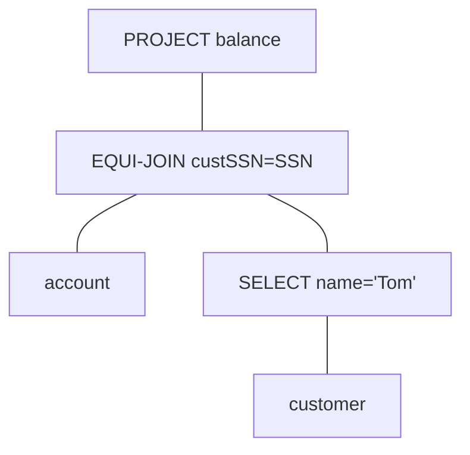

#relation-algebra

## I. Definition
---
Similar to the ER model, Relational Algebra has the basic model and extended model.

More formally,

> [!abstract] Definition
> relational algebra is a branch of math that deals with *algebraic operations (consisting of operands and operators) that represent relations*.
>  - as a query language for relations
>  - theoretical foundation for SQL
>
> The returned relations must have:
> - closure
> - composibility

## II. Operations
---
### BASIC Relational Algebra
- [[#Set Operations]]
- [[#Selection]]
- [[#Projection]]
- [[#Cartesian Products]]
- [[#Joins]]
- [[#Renaming]]

#### Set Operations
*Relation must have* **the same schema**.
- Union $\boldsymbol{\cup}$
- intersection $\boldsymbol{\cap}$
- difference $\boldsymbol{-}$

#### Selection
> [!info] Selection
> $$\underbrace{\sigma}_{Condition}(\text{R})$$
> Return tuples in R *that satisfies some condition C*.

#### Projection
> [!info] Project
> $$\underbrace{\Pi}_{A_1\dots A_k}(\text{R})$$
> Picks columns of attributes $[A_1, \dots A_k]$ of R, *and eliminates duplicate rows, if any*.

##### Extended Projection
> [!info] Extended Projection
> $$\underbrace{\Pi}_{[A_1\text{, }B:=(A_2 + A_3)]}(\text{R})$$
> The attribute list may contain arbitrary expression involving attributes:
> 1. Arithmetic operations on attributes, e.g. $A_1 + A_2 \rightarrow B$
> 2. Duplicate occurences of the same attributes.
>    $$\underbrace{\Pi}_{A_1, A_1, (A_2 + A_3),\dots}$$

#### Cartesian Products
> [!info] Cartesian Product $\times$
> $$\text{R}\times\text{S}$$
> Pairs each tuple **r** in **R** with each tuple **s** in **S**.
> - Schema of result is the attributes of R and then S, *in order*.
> - If attributes *A* exists both in R and S then use `R.A` and `S.A`.

#### Joins
> [!info] Join $\bowtie$
> $$\text{R}\underbrace{\bowtie}_{Condition}\text{S} = \underbrace{\sigma}_C(\text{R}\times\text{S})$$
> Take the product $R\times S$, and then apply $\sigma_C$ (conditional projection) to the result.

##### Theta-Join (non-equal)

$$R\underbrace{\bowtie}_{R.A>S.C}S$$
$$R\underbrace{\bowtie}_{R.A>S.C\quad\textbf{AND}\quad R.B\neq S.D}S$$

##### Equi-Join
- Equi-Join: **C** only uses the equality operator
$$R\underbrace{\bowtie}_{R.B=S.D}S$$

 ##### Natural-Join
- Connects two relations by:
	- equating attributes of the same name (equi-join), and
	- projecting out one copy of each of equated attributes.
- We have relations **R** and **S**,
	- Let *L* be the union of their attributes
	- Let $A_1\dots A_k$ be their common attributes
 
$$R\bowtie S = \underbrace{\Pi}_L(R\underbrace{\bowtie}_{(R.A_1=S.A_1)\textbf{... }(R.A_k=S.A_k)}S)$$

`Emp(name, dept)`
| Dept    | Name |
| ------- | ---- |
| Physics | Jack |
| EECS    | Tom  |

`Contact(name, addr)`
| Name | Addr    |
| ---- | ------- |
| Jack | Pullman |
| Tom  | Moscow  |
| Mary | Colfax  |

`Emp` $\bowtie$ `Contact`
| Dept    | Name | Addr    |
| ------- | ---- | ------- |
| Physics | Jack | Pullman |
| EECS    | Tom  | Moscow  |

#### Renaming
- **Renaming** of *relations* and *attributes* $\boldsymbol{\rho}$

### EXTENDED Relational Algebra
- [[#Outer-Joins]]
- [[#Grouping / Aggregation]]

#### Outer-Joins
- Outer-Join
- Full Outer-Join
- Left Outer-Join
- Right Outer-Join

#### Grouping / Aggregation
- Duplicate Elimination $\boldsymbol{\delta}$
- Sorting $\boldsymbol{\tau}$
- Grouping and Aggregation $\boldsymbol{\gamma}$
- Outer-Joins

## III. Building Complex Operations
---
### Notation Styles for Complex Expressions
1. Arithmetic style
2. Sequences of assignments statements
3. Expression trees

#### 1. Arithmetic
$$R\bowtie S = \underbrace{\Pi}_L(R\underbrace{\bowtie}_{(R.A_1=S.A_1)\textbf{... }(R.A_k=S.A_k)}S)$$

$$
R\cap S = R - (R - S)
$$

##### Precedence
1. () parenthesis
2. \[$\sigma$, $\Pi$, $\rho$\]
3. \[$\times$, $\bowtie$\]
4. \[$\cap$\]
5. \[$\cup$, $-$\]

#### 2. Sequence
$$
\underbrace{\Pi}_{balance} \left(\underbrace{\sigma}_{custsmm=ssn}(account \times (\underbrace{\sigma}_{name=Tom}customer))\right)
$$
where,
$$
\begin{align}
\underbrace{R_1}_{(ssn, name, city)} &:= \underbrace{\sigma}_{name=Tom}(customer)\cr
\underbrace{R_2}_{(ssn, name, city, custssn, balance)} &:=\underbrace{\sigma}_{custssn=ssn}(account\times R_1)\cr
\underbrace{Result}_{(balance)} &:=\underbrace{\Pi}_{balance}(R_2)
\end{align}
$$

#### 3. Expression Tree

## IV. Limitations
---
- Some queries cannot be represented
	- Recursive queries
- More expressive languages needed
