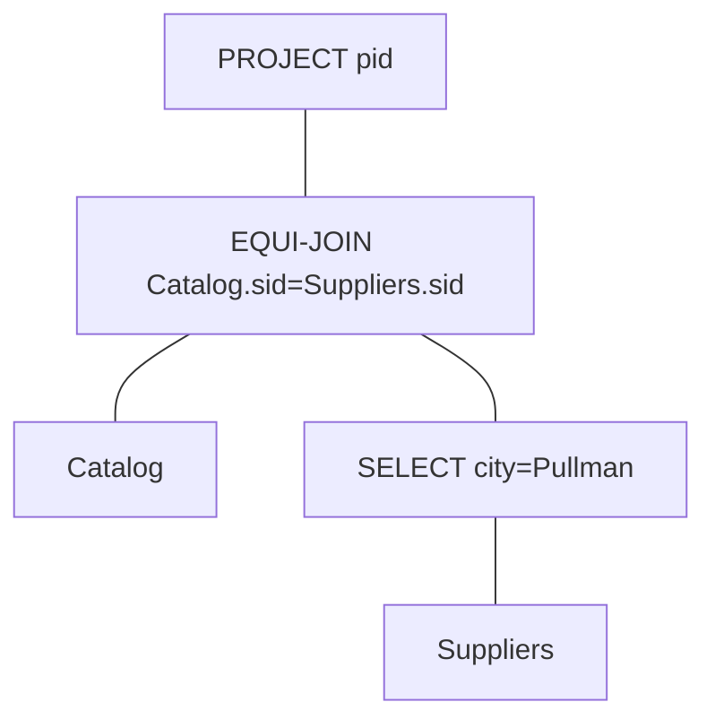
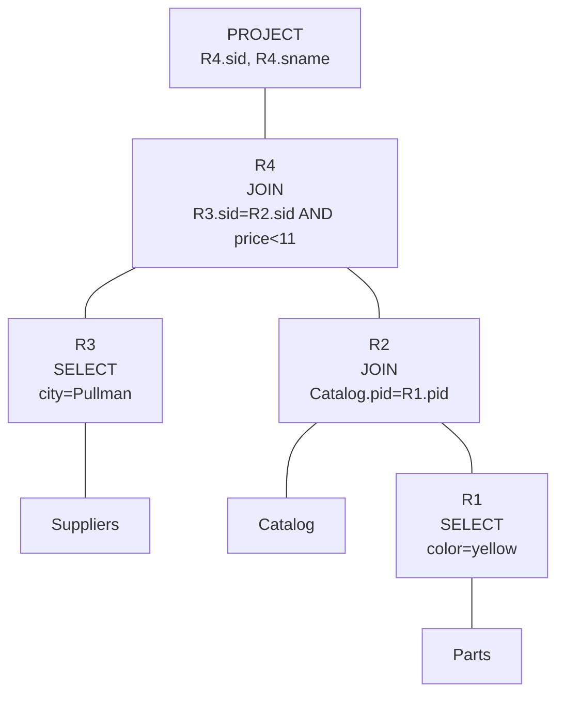
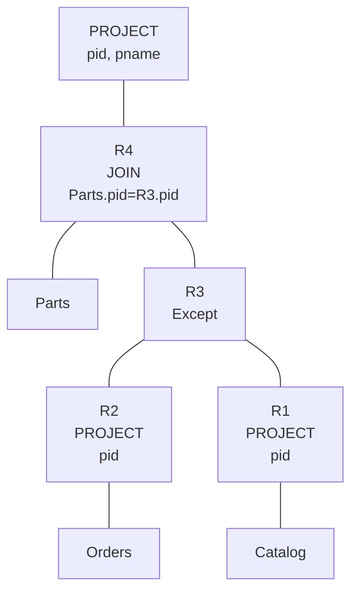
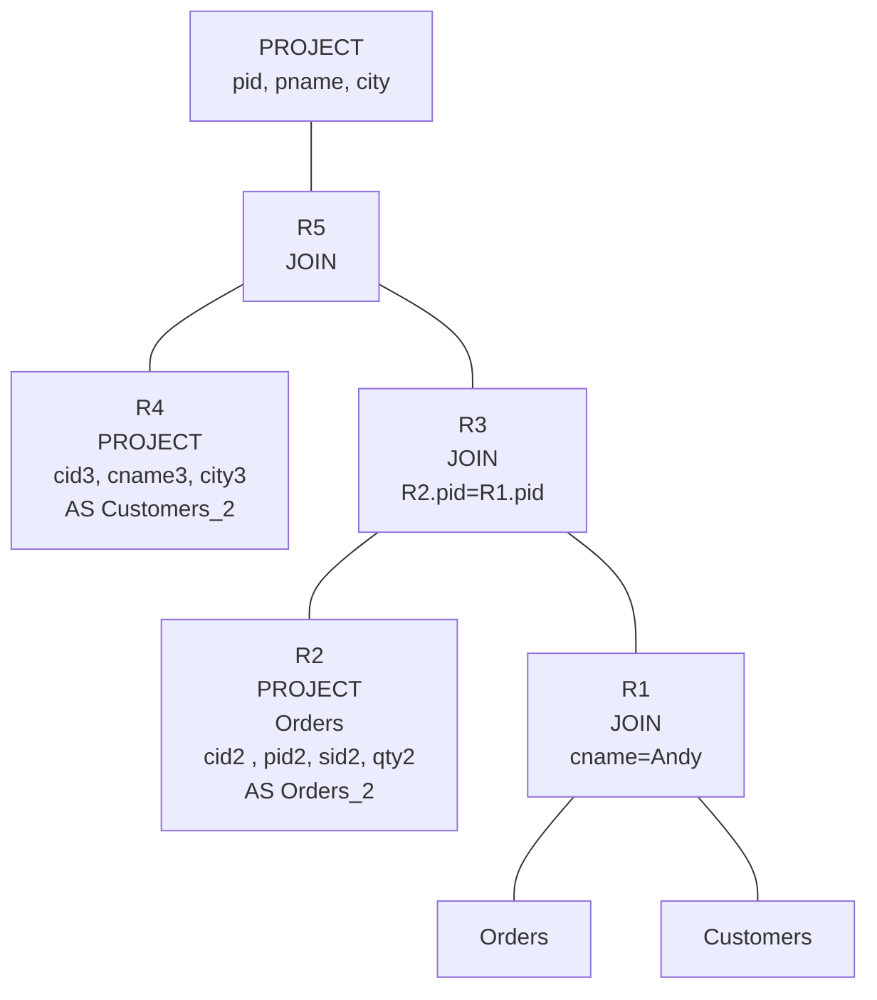
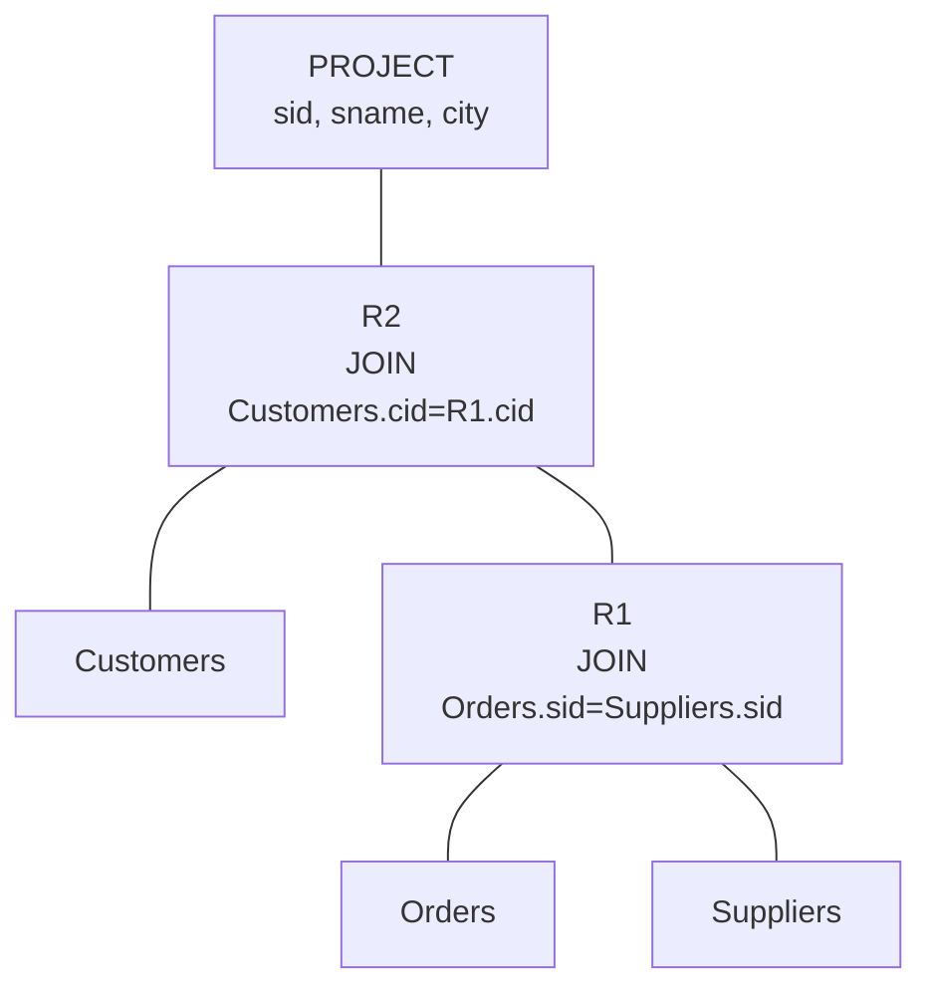
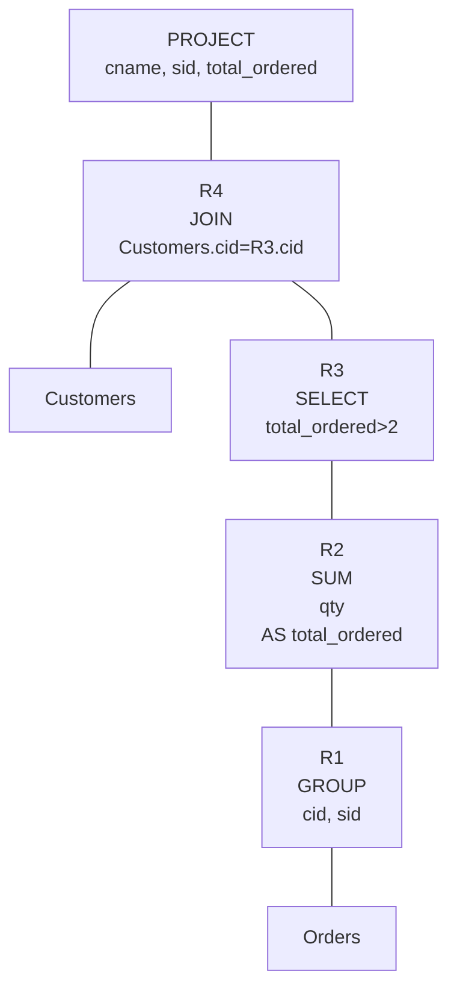
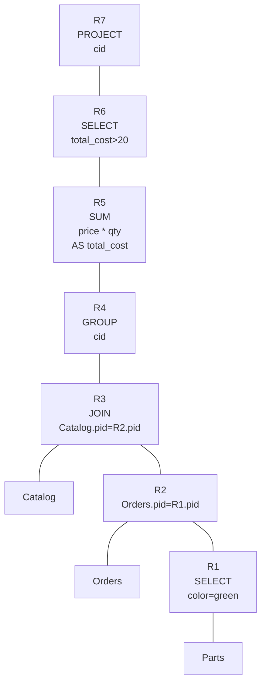
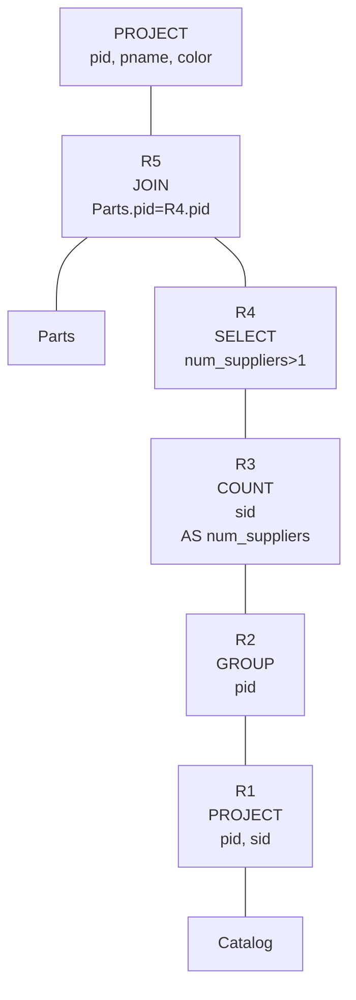
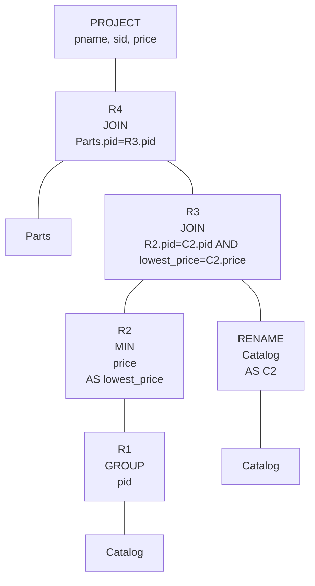
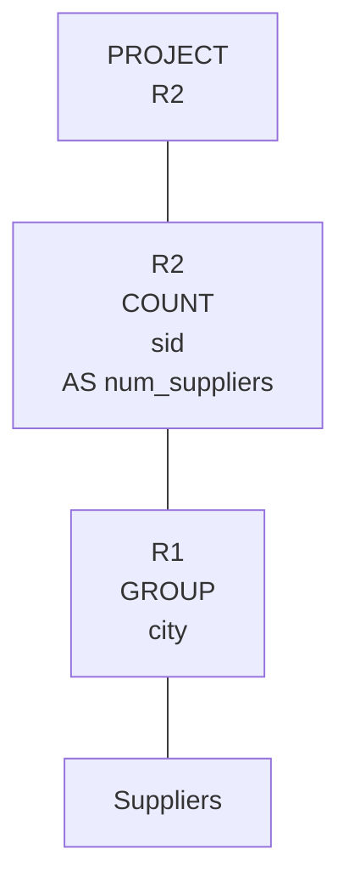

<h3>Washington State University</h3>
<h3>School of Electrical Engineering and Computer Science</h3>
<h3>CptS 451 – Introduction to Database Systems</h3>
<h3>Online</h3>

Dr. Sakire Arslan Ay

 
<h1>Homework-3</h1>
<h1>Relational Alrebra</h1>
 

Name: CHARLES NGUYEN

Student Number: 011606177

<table style="text-align: center; width:300px; height:100px">
	<tr>
		<th>Question</th>
		<th>Max Points</th>
		<th>Score</th>
	</tr>
	<tr>
		<td>1 through 10</td>
		<td>100</td>
		<td></td>
	</tr>
		<td></td>
		<td></td>
		<td></td>
	<tr>
		<td>Total</td>
		<td>100</td>
		<td></td>
	</tr>
</table>

##### 1. (10pts)
- Find all
	- *distinct*  **parts**
		- **supplied**
			- by *Pullman* stores
- Return matched pid **parts**.

- Solution:
	- R1: `SELECT * Suppliers WHERE city=Pullman`
	- R2: parts need to be matched with stores, so we choose Catalog
		- `SELECT * Catalog`
	- EQUI-JOIN R1 and R2 on (Catalog.sid = Suppliers.sid)
	- PROJECT on pid

$$
	\prod_{pid} \sigma_{\text{Catalog.sid=Suppliers.sid}}\left[Catalog \times \sigma_{city=\text{Pullman}} (Suppliers) \right]
$$

$$
\begin{align}
{R_1} &:= \sigma_{city=Tom}(Suppliers)\cr
{R_2} &:=\sigma_{Catalog.sid=Suppliers.sid}(Catalog\times R_1)\cr
{RESULT}_{pid} &:=\Pi_{pid}(R_2)
\end{align}
$$

##### 2. (10pts)
- Find
	- the **suppliers**
		- in *Pullman*
	- who supply
		- a *yellow* part
		- for *less than $11*
- Return matched sid and name of **suppliers**.

- Solution:
	- R1: `SELECT Parts WHERE color=yellow`
	- R2: EQUI-JOIN Catalog and R1 on (Catalog.pid=Parts.pid)
	- R3: `SELECT Suppliers WHERE city=Pullman`
	- R4: THETA-JOIN R3 and R2 on (R3.sid=R2.pid AND price < 11)
	- PROJECT on sid, sname
 
 *We can also just do Cartesian Product twice and then apply both conditions*:
$$
\prod_{\text{(sid, sname)}} \left[ \sigma_{\text{city=Pullman AND color=yellow}} (Suppliers \times Catalog \times Parts) \right]
$$
 

##### 3. (10pts)
- Find all
	- **parts**,
		- provided by *some suppliers*, i.e. present in **catalog**
			- i.e. *only those found in Catalog*
		- never **ordered** *by a customer*
- Return matched pid and pname of **parts**.

- Solution:
	- R1: `PROJECT pid FROM Catalog`
	- R2: `PROJECT pid FROM Orders`
	- R3: Take set EXCEPT on R1 and R2
	- R4: JOIN Parts and R3
	- PROJECT (pid, pname) from R4

$$
\prod_{\text{(pid, pname)}}
= Parts\times
\left[
	\Pi_{pid}(Orders)-\Pi_{pid}(Catalog)
\right]
$$

##### 4. (10pts)
- Find all
	- *Customers*, who
		- **ordered** *one of the products that* **Andy ordered**
			- i.e. someone who ordered at least one part as Andy's.
- Return matched (pid, pname, city) of **customers**.

- Solution:
	- R1: JOIN Customers and Order WHERE cname=Andy
	- R2: PROJECT (cid, pid, sid, qty) FROM Orders AS Orders_2
	- R3: JOIN R2 with R1 WHERE R2.pid=R1.pid
	- R4: PROJECT (cid3, cname3, city3) FROM Customers AS Customers_2
	- R5: JOIN R4 with R3
	- PROJECT (pid, pname, city) from R5

 $$
\begin{align}
\prod_{(cname2,city2,pid2)}=(\cr
&\Pi_{Customers2:=(cid3,cname3,city3)}\times (\cr
&\quad\Pi_{\text{Order2:=(cid2, pid2, sid2, qty2)}}\times\sigma_{pid2=pid} (\cr
&\quad\quad Orders\times\sigma_{\text{cname=Andy}}(Customers)\cr
&\quad\quad)\cr
&\quad)\cr
&)\cr
\end{align}
$$

##### 5. (10pts)
- Find **suppliers**, who
	- received orders from customers
		- who live in the *same city as the suppliers*
- Return matched (sid, sname, city) of suppliers.

- Solution:
	- R1: JOIN Orders and Suppliers WHERE Orders.sid=Suppliers.sid
	- R2: JOIN Customers and R1 WHERE Customers.cid = R1.cid
	- PROJECT (sid, sname, city) from R2

$$
\begin{align}
\prod_{(sid, sname, city)}=(\cr
&\sigma_{Customers.cid=cid}(Customers\times(\cr
&\quad\sigma_{Orders.sid=Suppliers.sid}(Orders\times Suppliers)\cr
&\quad)\cr
)
\end{align}
$$

##### 6. (10pts)
- Find **customers**, who
	- ordered qty>2 from a single supplier
- Return matched (cname, sid, total_ordered)

- Solution:
	- R1: GROUP Orders by (cid, sid)
	- R2: Aggregate R1 by SUM  the qty attribute in each group in R1 AS total_ordered
	- R3: SELECT from R1 WHERE total > 2
	- R4: JOIN Customers with R3
	- PROJECT (cname, sid, total_ordered)

$$
\begin{align}
\prod_{(cname, sid, total\_ordered)} = (\cr
&\sigma_{Customers.cid=cid}(\cr
&\quad Customers\times(\sigma_{\text{total\_ordered>2}}(\cr
&\gamma_{(\text{cid, sid, total\_order:=SUM(qty)})} (Orders)\cr
)
)
\end{align}
$$

##### 7. (10pts)
- Find the customer, who
	- paid more than $20 on 'green' parts
		- total cost of orders on green parts is more than $20
- Return cid from customers.

- Solution:
	- R1: SELECT from Parts WHERE color=green
	- R2: JOIN Orders and R1
	- R3: GROUP R2 by cid
	- R4: Aggregate R3 by SUM by (price * qty) AS total_cost
	- R5: SELECT those with total_cost > 20
	- R6: PROJECT on cid

$$
\begin{align}
\prod_{cid} = (\cr
&\sigma_{\text{total\_cost>20}}(\cr
&\quad\gamma_{(\text{cid, total\_cost:=SUM(price*qty)})} (\cr
&\quad\quad Catalog\times Orders\times (\sigma_{\text{color=green}}(Parts))\cr
&\quad\quad)\cr
&\quad)\cr
&)
\end{align}
$$

##### 8. (10pts)
- Find the parts, which
	- are supplied by at least 2 different suppliers
		- *market availability, i.e. catalog*
- Return (pid, pname, color) of those parts.

- Solution:
	- R1: PROJECT (pid, sid) from Catalog
	- R2: GROUP R1 by pid
	- R3: Aggregate R2 by COUNT on (sid) for suppliers AS num_suppliers
	- R4: SELECT from R3 WHERE num_suppliers>1
	- R5: JOIN Parts with R4
	- PROJECT (pid, pname, color) from R5

$$
\begin{align}
\prod_{(pid,pname,color)} = (\cr
&\sigma_{Parts.pid=pid}(Parts\times\sigma_{num\_suppliers>1}(\cr
&\quad\gamma_{(\text{pid,num\_suppliers:=COUNT(sid)})}(\cr
&\quad\quad\Pi_{(pid,sid)}(Catalog)\cr
&\quad\quad)\cr
&\quad)\cr
&)
\end{align}
$$

##### 9. (10pts)
- Find the supplier of every part in the catalog, who
	- offers the lowest price.
- Return (pname, sid, price) for the parts.

- Solution:
	- R1: GROUP Catalog by (pid)
	- R2: Aggregate R1 by MIN on (price) AS lowest_price
	- RENAME Catalog AS C2
	- R3: JOIN R2 with C2
	- R4: JOIN Parts with R3
	- PROJECT (pname, sid, price) from R4

$$
\begin{align}
\prod_{(pname,sid,price)} = (\cr
&\sigma_{Parts.pid=pid}(Parts\times\sigma_{}(\cr
&\quad\gamma_{(\text{pid, lowest\_price:=MIN(price)})}\times\Pi_{*}(Catalog)\cr
&\quad)\cr
&)
\end{align}
$$

##### 10. (10pts)
- Find the number of suppliers in each city.

- Solution:
	- R1: GROUP Suppliers by (city)
	- R2: Aggregate R1 by COUNT on (sid) as num_suppliers
	- PROJECT result

$$
\prod = \gamma_{\text{city, num\_suppliers:=COUNT(sid)})}(Suppliers)
$$

